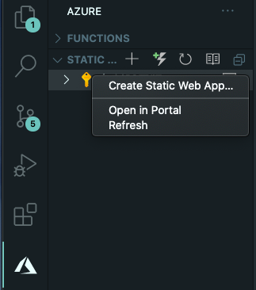

## 📝 Azure Static Web Apps の作成

Azure Portal からリソース作成することもできますが，ここではより簡単な VSCode を用いた方法を紹介します。

1. VSCode の Azure Static Web Apps 拡張機能をインストールする

    

    以降の手順では，VSCode の Azure Static Web Apps 拡張機能の [README.md](https://github.com/microsoft/vscode-azurestaticwebapps) に書いてある手順を実行します。

2. VSCode の左側タブの Azure アイコンをクリックして `+` アイコンをクリックすると，リソース作成ダイアログに進みます。

    

    